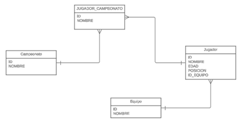

# Spring Boot
# Índice

1. [Introducción a Spring Boot](#introducción)
2. [Guía de Instalacion](#Guía-de-Instalación)  
3. [Cifras](#cifras)  
4. [Comparativa de Frameworks](#comparativa-de-frameworks)  
5. [Justificación](#justificación)  
6. [Spring Initializr](#spring-initializr)  
7. [API REST](#api-rest)  
8. [Configuración del Proyecto](#configuración-del-proyecto)  
9. [¿Qué es JPA?](#qué-es-jpa)  
10. [Conexión de la Base de Datos con Spring Boot](#¿Cómo-conectar-la-base-de-datos-con-el-archivo-de-Spring-Boot?)  
11. [Anotaciones principales de las Entidades](#anotaciones-principales-de-las-entidades)  
12. [Anotaciones para Relaciones entre Tablas](#anotaciones-para-relaciones-entre-tablas)  
13. [Respositorios](#Repositorios)  

---

## **Introducción:**

Spring Boot es una extensión de Spring, este último es un framework de desarrollo que permite crear aplicaciones empresariales robustas, escalables y seguras para Java, Kotlin y Groovy. Spring Boot simplifica aún más el desarrollo de aplicaciones al reducir la cantidad de configuración manual requerida y proporcionar características listas para usar.

Esto significa que, por la naturaleza del framework, se reduce la necesidad de configuración manual a través de convenciones y autoconfiguración, ayudando a que la programación sea más fácil e intuitiva.

Además, es ampliamente utilizado en el desarrollo de plataformas web, siendo uno de los frameworks más conocidos para el lenguaje que se enseña principalmente en la universidad: Java. Preferimos usar Spring Boot sobre el Spring tradicional, ya que este último requiere configuración explícita del contexto de aplicación y los beans, mientras que Spring Boot usa autoconfiguración.

Spring Boot se complementa con Spring Data JPA (Java Persistence API), un ecosistema que proporciona una capa de abstracción para interactuar con bases de datos relacionales y no relacionales como PostgreSQL. Este enfoque permite a los desarrolladores enfocarse en la lógica de la base de datos, reduciendo la cantidad de código necesario para operaciones CRUD.

El propósito de esta presentación es enseñar cómo utilizar Spring Boot y Spring Data JPA con PostgreSQL desde el editor IntelliJ mediante un ejemplo práctico.

---
# Guía de Instalación

Este proyecto incluye guías detalladas para la instalación en diferentes sistemas operativos. Haz clic en los enlaces correspondientes para más información:

- [Instalación en Windows](WINDOWS-64BITS.md)
- [Instalación en Linux](linux-spring-setup.md)

---

## **Cifras:**

Empresas reconocidas que usan Spring en su arquitectura incluyen:

- **Netflix**: $31.6 mil millones  
- **eBay**: $9.8 mil millones  
- **Alibaba**: $125.5 mil millones  
- **BMW**: $132.2 mil millones  
- **IBM**: $60.5 mil millones  

---

## **Comparativa de Frameworks:**

**Spring Boot vs otros frameworks para Java:**

| Framework     | Ventajas                                               | Desventajas                                                                 |
|---------------|--------------------------------------------------------|-----------------------------------------------------------------------------|
| **Java EE**   | Basado en especificaciones estándar.                   | Configuración extensa y menor popularidad frente a Spring.                 |
| **Grails**    | Simplifica el desarrollo con un enfoque opinado.       | Documentación menos extensa que Spring.                                    |
| **Play**      | Paradigma reactivo moderno.                            | Puede ser desafiante para quienes prefieren enfoques tradicionales.        |
| **Micronaut** | Ligero y rápido para microservicios.                   | Comunidad más pequeña y menor popularidad en comparación con Spring.       |

---

## **Justificación:**

Elegimos Spring Boot por su popularidad, facilidad de uso, menor cantidad de código necesario y la amplia comunidad que lo respalda.



---

## **Spring Initializr:**

[Spring Initializr](https://start.spring.io) es una herramienta en línea que facilita la configuración inicial de proyectos Spring Boot. Proporciona una interfaz intuitiva donde puedes seleccionar dependencias, lenguaje, versión de Spring Boot, tipo de empaquetado, entre otros.  

### **Pasos para usar Spring Initializr:**
1. Accede a [Spring Initializr](https://start.spring.io).  
2. Configura las opciones del proyecto:  
   - **Project:** Maven o Gradle.  
   - **Language:** Java, Kotlin o Groovy.  
   - **Spring Boot Version:** Selecciona la versión deseada.  
3. Agrega dependencias necesarias como:  
   - **Spring Web** para APIs REST.  
   - **Spring Data JPA** para bases de datos.  
   - **PostgreSQL Driver** para conectarse a PostgreSQL.  
4. Descarga el proyecto generado y ábrelo en tu IDE preferido, como IntelliJ.  

### **Ventajas de Spring Initializr:**
- Ahorra tiempo al configurar proyectos.  
- Genera un código base limpio y estructurado.  
- Garantiza compatibilidad entre dependencias.  

---

## **API REST:**

### Principios REST:
- **Cliente-servidor**: Separación de responsabilidades.  
- **Sin estado**: Las solicitudes HTTP no dependen de estados previos.  
- **Cacheable**: Mejora el rendimiento al permitir almacenamiento en caché.  
- **Interfaz uniforme**: Uso de métodos estándar como `GET`, `POST`, `PUT` y `DELETE`.  
- **Recursos**: Representados por URIs únicos, como `/users` o `/orders`.  
- **Representación de recursos**: JSON, XML, HTML, etc.

### Ejemplo de peticiones:
1. **Obtener todos los jugadores**  
   - Método HTTP: `GET`  
   - URI: `/jugadores`  
   - Respuesta: JSON con la lista de jugadores.  

2. **Crear un jugador**  
   - Método HTTP: `POST`  
   - URI: `/jugadores`  
   - Cuerpo: JSON con los detalles del jugador.  

3. **Actualizar un jugador**  
   - Método HTTP: `PUT`  
   - URI: `/jugadores/{id}`  
   - Cuerpo: JSON con los datos actualizados.  

4. **Eliminar un jugador**  
   - Método HTTP: `DELETE`  
   - URI: `/jugadores/{id}`  

---

## **Configuración del Proyecto:**

### **Dependencias en Spring Boot:**
Spring Boot usa **starters** para simplificar la carga y gestión de dependencias, con el objetivo de agrupar las dependencias necesarias para cada funcionalidad en vez de agregar cada dependencia de manera manual. Algunos starters útiles incluyen:  
- **spring-boot-starter-web**: Para crear aplicaciones web y APIs REST.  
- **spring-boot-starter-data-jpa**: Para manejar operaciones con bases de datos.

Al descargar el archivo de [Spring Initializr](https://start.spring.io) con las dependencias necesarias para el proyecto, se genera un archivo **pom.xml**, el cual trae consigo todas las dependencias agrupadas.

### **Archivos de Configuración:**
1. **application.properties**: Configuración basada en un formato clave-valor.  
2. **application.yaml**: Configuración jerárquica en formato YAML, cuya sintáxis es sencilla y legible.  

### Ejemplo de configuración YAML:
Adicionalmente, al final del anterior archivo de configuración .yaml se evidencia como se pueden configurar credenciales de correo en caso de ser necesarios envios de correo en la ejecución del programa (en el ejemplo se muestra como sería para una cuenta de correo @gmail).
```yaml
spring:
  datasource:
    url: jdbc:postgresql://localhost:5432/mi_base_datos
    username: postgres
    password: mi_contraseña
    driver-class-name: org.postgresql.Driver
  jpa:
    hibernate:
      ddl-auto: update
    show-sql: true
    properties:
      hibernate:
        format_sql: true
    database-platform: org.hibernate.dialect.PostgreSQLDialect
  mail:
      host: smtp.gmail.com
      port: 587 ##puerto por defecto
      username: tucorreo@gmail.com
      password: tucontraseña
      properties:
        mail.smtp.auth: true
        mail.smtp.starttls.enable: true
```
---
## **¿Qué es JPA?**

JPA (Java Persistence API) es **una herramienta que facilita la interacción entre las aplicaciones Java y las bases de datos**.

### **Explicación Sencilla:**

* **Qué es JPA**: JPA es una especificación de Java que te permite trabajar con bases de datos usando objetos de Java en lugar de escribir consultas SQL complejas.  
* **Cómo Funciona**: Imagina que tienes una clase Java llamada `Jugador` con atributos como `nombre`, `edad`, etc. JPA te permite guardar objetos de esa clase directamente en la base de datos y también recuperarlos fácilmente.  
* **Ventajas**:  
  1. **Menos Código SQL**: En lugar de escribir muchas líneas de SQL, puedes trabajar con métodos y objetos de Java.  
  2. **Portabilidad**: JPA funciona con diferentes bases de datos (MySQL, PostgreSQL, Oracle, etc.) sin necesidad de cambiar tu código.  
  3. **Mantenimiento Simplificado**: Al usar JPA, el código es más limpio y más fácil de entender.
---
## **¿Cómo conectar la base de datos con el archivo de Spring Boot?**  
  
En la carpeta de resources al archivo que tiene el nombre de application.properties, le cambiamos el nombre a application.yaml, que es donde irán las configuraciones para conectar la base de datos. 

Vamos a conectar la base de datos a nuestro archivo con SpringBoot:

Instalamos el plugin DB Navigator:
Acá podemos comprobar que la conexión con la base de datos es exitosa: 
Las entidades JPA son clases de Java que representan tablas en una base de datos relacional. Se utilizan para mapear objetos Java a tablas de bases de datos, lo que permite a los desarrolladores trabajar con datos relacionales utilizando objetos Java.

   

---
## **Anotaciones principales de las entidades**  
   - @Entity: Marca la clase de java como una entidad JPA, lo que significa que será mapeada a una tabla en la clase en la base de datos.  
   - @Table: Es una anotación opcional, se puede usar para especificar el nombre de la tabla y otros detalles de la tabla en la base de datos.  
```
@Entity
@Table(name = "empleado")
public class Empleado{
```
Si no se tiene la anotación @Table la tabla será creada con el nombre de la clase.  
   - @Id: Marca el atributo como la clave primaria de la identidad.  
   - @GenerateValue Opcionalmente, se puede usar junto con la anotación @Id para especificar cómo se generará el valor de la clave primaria:

 - GenerationType.AUTO: Permite a JPA elegir la estrategia de generación de claves automáticamente según el proveedor de la base de datos. Es el valor predeterminado.

 - GenerationType.IDENTITY: Utiliza una columna de incremento automático de la base de datos. Este valor es ideal si estás usando bases de datos que soportan columnas auto-incrementales, como MySQL.

 - GenerationType.SEQUENCE: Usa secuencias de base de datos para generar el valor de la clave primaria. Esto es útil en bases de datos que tienen soporte para secuencias, como PostgreSQL y Oracle. Para utilizar esta estrategia, normalmente debes definir una secuencia en la base de datos y, opcionalmente, puedes especificar su nombre con la anotación @SequenceGenerator.

 - GenerationType.TABLE: Almacena el último valor de la clave en una tabla especial en la base de datos y usa este valor para generar claves únicas. Este enfoque es útil para bases de datos que no admiten incrementos automáticos o secuencias, pero puede tener un rendimiento inferior en comparación con otras estrategias.

   - @Column: Permite personalizar el mapeo entre el atributo de la clase y la columna en la tabla de la base de datos.  
```
@column(name = "mail", length  = 70)
private String email;
``` 
   - @Transient: Marca un atributo de la clase como no persistente, lo que significa que no se mapeará a una columna en la tabla de la base de datos.  
   - @Temporal: Se utiliza para indicar cómo se debe tratar una propiedad de tipo java.util.Date o java.util.Calendar cuando se mapea a una base de datos.  
```
@Temporal(TemporalType.DATE)
private Date fechaNacimiento;
``` 
día, mes y año  
```
@Temporal(TemporalType.TIME)
private Date hora;
``` 
hora, minutos y segundos  
```
@Temporal(TemporalType.TIMESTAMP)
private Date fecha_hora;
``` 
día, mes, año y hora, minutos y segundos

Las entidades se almacenan en la carpeta de models siguiendo el patrón de MVC.
Ahí se explican las entidades del ejemplo.

---
## **Anotaciones para Relaciones entre Tablas**  
Desde las clases de modelo, se codifica, desde las entidades, las relaciones que se van a establecer las distintas tablas.  
 - @ManytoOne  
```
@ManyToOne
@JoinColumn(name = "equipo_id")
private Equipo equipo;
```
Desde la clase jugador se crea una relación de Muchos a uno para muchos jugadores a un equipo.  
Se crea el atributo con la llave foránea llamado “equipo \_id” que pertenece a la entidad de Jugadores  
Instancia un equipo de tipo Equipo que demuestra que cada que se cree un Jugador habrá una instancia de un Equipo asociada a dicho jugador  
 - @OnetoMany  
```
@oneToMany(mappedBy = "equipo", cascade = CascadeType.ALL)
private List<Jugador> jugadorList;
``` 
Relación de uno a muchos de la entidad de Equipo a Jugadores  
El primer atributo mappedBy le da la responsabilidad a la propiedad equipo de la Lista de Jugadores.  
El segundo atributo especifica cómo se comportará la cascada para la relación la cual puede ser de las siguientes tres maneras:

1. Persistencia (PERSIST)  
2. Eliminación (REMOVE): Si eliminas una entidad, todas las entidades relacionadas serán eliminadas igualmente   
3. Fusión (MERGE): Si actualizas una entidad, las relacionadas serán actualizadas igualmente (se utiliza para guardar datos)  
4. Refrescar (REFRESH): Si refrescas una entidad, las relacionadas serán actualizadas en la base de datos (se utiliza para la restauración de datos)  
5. Desvinculación (DETACH): Se refiere a desvinculación con la operación de quitar el contexto de persistencia a una entidad junto con sus relaciones. (desincronización con la base de datos )  
6. Todas (ALL): Son todos los anteriores comportamientos para la relación entre Equipo y Jugadores

Por último se crea una lista con instancias de tipo Jugador para muchos jugadores.  
 - @ManytoMany  
```
@ManyToMany
@JoinTable(
      name = "CAMPEONATO_JUGADOR",
      joinColumns = @JoinColumn(name = "jugador_id"),
      inverseJoinColumns = @JoinColumn(name = "campeonato_id")
)
private List<Campeonato> campeonatoList;
```  
Desde la entidad de Jugadores se establece la relación de muchos a muchos jugadores  
@JoinTable es la notación que se usa para definir la tabla intermedia y guardar los datos de ambas tablas.  
Se le da el nombre a la tabla, se especifican los atributos foráneos que se le dará a la tabla incluyendo jugador id y campeonato \_id uniendo las distintas columnas.  
Al igual que con  One to Many se crea una lista pero en este caso para campeonato.
También desde la tabla de campeonatos se agrega la notación ManyToMany con la diferencia que no se incluye la notación de Join Table puesto que esta ya se estableció en la entidad de jugador.
```
@ManyToMany(mappedBy = "campeonatoList")
private List <Jugador> jugadorList;
``` 
---
## **Repositorios**  
Un repositorio es un componente que actúa como puente entre la aplicación y la base de datos. Los repositorios en Spring Data JPA están diseñados para aprovechar las capacidades de JPA y facilitar las operaciones con la base de datos.

La interfaz JpaRepository\<T, ID\> extiende CrudRepository y PaginAndSortingRepository, lo que da acceso a una amplia gama de métodos predefinidos.

### **Sintaxis del repositorio**  
Para crear un repositorio, solo se necesita definir una interfaz que extienda de JpaRepository. La interfaz pide dos parámetros:

   - T: La entidad sobre la que se va a realizar la persistencia  
   - ID: El tipo de dato de la clave primaria de la entidad.

La interfaz JpaRepository proporciona muchos métodos útiles para trabajar con entidades. Algunos de los más comunes son:

### **Operaciones CRUD:**  
 - save(S entity): Guarda o actualiza una entidad en la base de datos.  
 - findById(ID id): Encuentra una entidad por su clave primaria.  
 - findAll(): Recupera todas las entidades del repositorio.  
 - delete(T entity): Elimina una entidad de la base de datos.  
 - deleteById(ID id): Elimina una entidad por su clave primaria.

### **Paginación y Ordenación:**  
 - findAll(Sort sort): Encuentra todas las entidades y las ordena.

### **Consulta personalizada**  
 - También se puede definir consultas personalizadas y más complejas utilizando la la anotación de @Query. 

Por ejemplo:
```  
@Query("SELECT j FROM Jugador j WHERE j.equipo.nombre \= :nombreEquipo") List\<Jugador\> findJugadoresByEquipoNombre(@Param("nombreEquipo") String nombreEquipo);
```

 - @Param("nombreEquipo"): Esta anotación vincula el parámetro de la consulta :nombreEquipo con el argumento que le pasas al método en tiempo de ejecución. Es decir, el valor del argumento nombreEquipo que le pases cuando llames al método será utilizado para reemplazar el parámetro :nombreEquipo en la consulta.

 - Los  “:” indica que se va a pasar un parámetro en tiempo de ejecución.

 - nativeQuery \= true: Indica que la consulta está escrita en SQL nativo y no en JPQL. Esto significa que la consulta interactúa directamente con las tablas de la base de datos en lugar de trabajar con las entidades de JPA.

   1. **Lombok**: Es una biblioteca que reduce el código repetitivo en Java, como getters, setters, toString, equals, y hashCode. Al agregar Lombok, puedes usar anotaciones como @Getter, @Setter, @ToString, @EqualsAndHashCode, y @AllArgsConstructor, entre otras, que Lombok procesará en tiempo de compilación para generar este código automáticamente.

   2. **Spring Web**: Esta dependencia incluye las herramientas necesarias para construir aplicaciones web, incluyendo aplicaciones RESTful. Al agregarla, obtienes soporte para el modelo de programación MVC (Modelo-Vista-Controlador) de Spring, que permite crear endpoints, gestionar solicitudes HTTP, y desarrollar APIs web.

   3. **Spring Data JPA**: Proporciona una implementación de JPA (Java Persistence API) de Spring, que facilita la interacción con bases de datos relacionales. Con esta dependencia, puedes crear repositorios para interactuar con tus entidades de base de datos de forma fácil y sin escribir mucho código SQL, ya que Spring Data JPA genera las consultas automáticamente a partir de los métodos definidos en tus interfaces de repositorio.

   4. **PostgreSQL Driver**: Es el controlador JDBC para la base de datos PostgreSQL. Necesitas este controlador para que tu aplicación Spring Boot pueda conectarse y comunicarse con una base de datos PostgreSQL, permitiéndote realizar operaciones CRUD (Crear, Leer, Actualizar, Borrar) en la base de datos.

Referencias  
 - [https://www.tutorialesprogramacionya.com/springbootya/detalleconcepto.php?punto=13\&codigo=14\&inicio=0](https://www.tutorialesprogramacionya.com/springbootya/detalleconcepto.php?punto=13&codigo=14&inicio=0)   
 - [https://programandoenjava.com/jparepository-en-spring-data/](https://programandoenjava.com/jparepository-en-spring-data/) 
