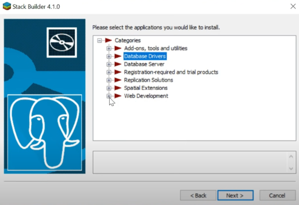
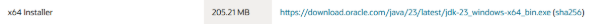
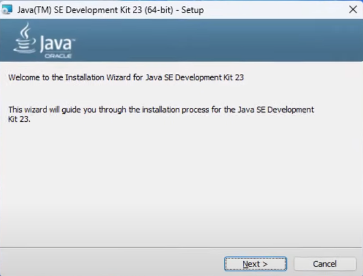
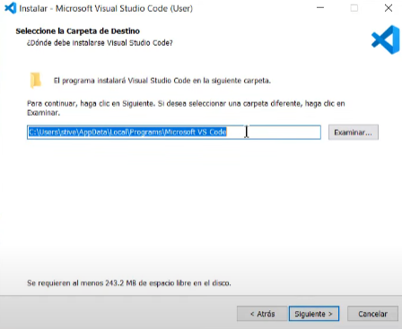
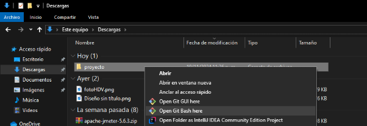
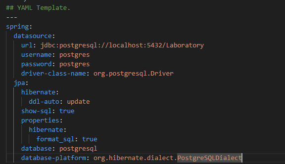
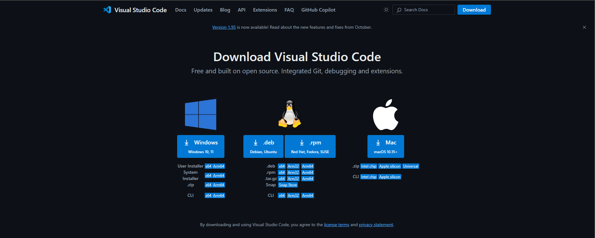

**Proceso de Instalación de herramientas y proyecto con spring framework (WINDOWS 64 BITS)**

**Herramientas para desarrollo**

- PostgreSQL/ pgAdmin4
- Postman
- JDK 23
- Visual Studio Code

**Primer Paso**

ingresar a https://www.enterprisedb.com/downloads/postgres-postgresql-downloads
seleccionamos Windows x86-64 con la version **17**

**Segundo Paso**

una vez ya descargado el instalador se ejecuta y pregunta la ruta donde quiere instalar postgres

**Tercer Paso**

Seleccionamos qué programas queremos descargar y seleccionamos todos, ya que el primero es el servidor, el segundo es la interfaz gráfica, el tercero es el instalador y el cuarto es un programa que funciona desde la consola.

**Cuarto Paso**

Ingresar unas credenciales para poder ingresar a postgresql

**Quinto Paso**

Dejamos el puerto por defecto de postgres 5432

**Inicio de stack builder**

**SEXTO PASO**

seleccionamos postgresql y damos click a siguiente

**SÉPTIMO PASO**

donde dice database drivers seleccionamos la opción jdbc y en el apartado de web development la que dice httpd 59-1

**OCTAVO PASO**

dar click en siguiente hasta que finalice la instalación.
Una vez terminada la instalación ya tenemos postgresql y pgAdmin, la interfaz para ver las bases de datos de postgres.

**NOVENO PASO**

ingresamos a https://www.postman.com/downloads/ damos click en instalar para windows x64 e iniciamos sesión con nuestra cuenta de google

**DÉCIMO PASO**

ingresamos a https://www.oracle.com/co/java/technologies/downloads/ y seleccionamos esta opcion

**ONCEAVO PASO**

Damos click a next hasta finalizar la instalación

**DOCEAVO PASO**

Ingresamos a https://code.visualstudio.com/ damos click en  instalar para windows.

**TRECEAVO PASO**
Seleccionamos la ruta que deseemos y damos a siguiente.

en los siguientes pop ups dejamos las opciones por defecto y le damos a instalar .

**CATORCEAVO PASO**

en abrimos visual studio code y seleccionamos este icono ubicado en la parte superior izquierda.

y descargamos la siguiente extensión.

Una vez tengamos ya descargadas estas tres herramientas nos vamos a dirigir a github a clonar el repositorio del proyecto con spring.

**QUINCEAVO PASO**

creamos una carpeta con el nombre que queramos y clonamos el repositorio de github.

en la consola ejecutamos el comando git clone https://github.com/Petriv2004/Jugadores.git

**DIECISEISAVO PASO**

Abrimos el proyecto con visual studio code y entramos a la configuración del programa y ponemos nuestras credenciales en el archivo application.yaml ubicado en la carpeta resources del proyecto.

veremos un archivo de configuración como este y en la parte de username y password ponemos las credenciales que pusimos para la base de datos en el instalador de postgres.

**DIECISIETEAVO PASO**

Nos dirigimos a la clase principal del proyecto que se llama jugadoresApplication.java y compilamos el programa y estaría listo para hacer las peticiones por postman.

**DIECIOCHOAVO PASO**

En la parte superior Izquierda especificamos el tipo de petición que vamos a hacer en este caso post, a la derecha ingresamos la url del backend con su cuerpo en formato json y con esta petición podemos agregar el jugador.

**TODAS LAS PETICIONES**

**POST**

 - localhost:8080/campeonatos/add

{
  "nombre": "La Liga"
}

- localhost:8080/equipos/add
  
{
  "nombre": "R. Madrid"
}

**PUT**

- localhost:8080/jugador/1
  
{
  "nombre": "Juan Pérez",
  "edad": 20,
  "posicion": "Volante",
  "equipo": {
    "id": 2,
    "nombre": "City"  
  },
  "campeonatoList": [
    {
      "id": 1,
      "nombre": "Campeonato Nacional"
    },
    {
      "id": 2,
      "nombre": "La Lig"
    }
  ]
}

- localhost:8080/equipos/2

{
  "nombre": "M. City"
}

- localhost:8080/campeonatos/2

{
  "nombre": "La Liga"
}

**GET (SIN CUERPO)**

- localhost:8080/jugador/all localhost:8080/equipos/all 

- localhost:8080/campeonatos/all 

- localhost:8080/campeonatos/campeonatoJ/3

- localhost:8080/equipos/jugadoresT/3

- localhost:8080/jugador/orderbyName

**DELETE (SIN CUERPO)**

- localhost:8080/jugador/1
  
- localhost:8080/equipos/2
  
- localhost:8080/campeonatos/2

**RECUERDE QUE PARA INGRESAR UN JUGADOR DEBE EXISTIR PREVIAMENTE EL EQUIPO Y LA LIGA A LA QUE PERTENECE**

